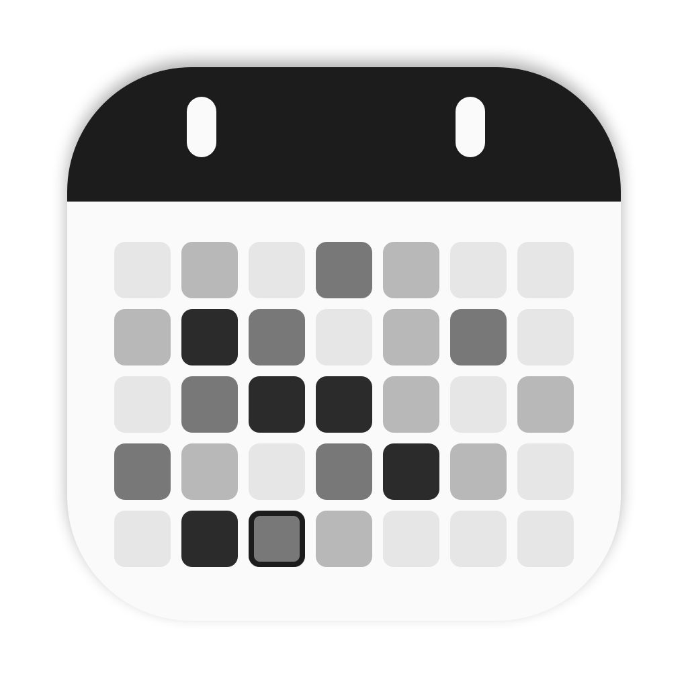

# DayStack

[English](README.md) · **한국어**

Mac 메뉴 막대에 사는 작은 캘린더 + 할 일 앱입니다. 흑백 활동 히트맵으로 하루하루를 한눈에 보고, 친구와 할 일을 공유할 수 있어요.

<p>
  
  
</p>

## ⬇️ 설치

macOS 13 이상, Apple Silicon(M1 이상) Mac에서 동작합니다.

### 가장 쉬운 방법: 터미널에 한 줄 (보안 경고 없음)

**터미널**을 열고 아래 한 줄을 붙여넣은 뒤 Return을 누르세요.

```bash
curl -fsSL https://raw.githubusercontent.com/Sskskxi/daystack/main/install.sh | bash
```

최신 DayStack을 내려받아 응용 프로그램 폴더에 넣고 바로 실행합니다. "확인할 수 없음" 경고도 뜨지 않아요. 나중에 같은 줄을 다시 실행하면 최신 버전으로 업데이트됩니다.

### 또는: .dmg 파일로 설치

**[DayStack.dmg 다운로드](https://github.com/Sskskxi/daystack/releases/latest/download/DayStack.dmg)**

1. `DayStack.dmg`를 열고 **DayStack**을 **Applications**(응용 프로그램) 폴더로 끌어다 놓으세요.
2. 응용 프로그램 폴더에서 **DayStack**을 여세요.
3. macOS가 앱을 *확인할 수 없다*고 알려줍니다. **시스템 설정 → 개인정보 보호 및 보안**을 열고 아래로 스크롤해서 DayStack 옆의 **확인 없이 열기**를 누른 뒤 확인하세요. 이 과정은 처음 한 번만 하면 됩니다.

설치가 끝나면 화면 오른쪽 위 메뉴 막대에서 캘린더 아이콘을 찾아 클릭하세요.

> 아이콘이 안 보이나요? 노치가 있는 MacBook에서는 메뉴 막대 아이콘이 많으면 카메라 뒤로 숨을 수 있어요. 다른 앱을 한두 개 종료하거나, **시스템 설정 → 메뉴 막대**에서 DayStack이 켜져 있는지 확인하세요.

## 주요 기능

- **캘린더:** 그날 끝낸 할 일이 많을수록 날짜 칸이 회색 → 검정으로 진해지고, 등록한 할 일 개수만큼 날짜 아래에 작은 점이 찍혀요 (최대 5개).
- **스택 히트맵:** 격자 버튼을 누르면 최근 18주를 GitHub 잔디처럼 한눈에 볼 수 있어요.
- **빠른 할 일 추가:** 날짜를 클릭하고 입력한 뒤 ⏎ 또는 **+** 버튼. 할 일을 더블클릭하면 수정, 마우스를 올리면 ⋯ 메뉴가 나타납니다.
- **카테고리:** 할 일을 업무·학업·개인(또는 직접 만든 카테고리, 색상 포함 — **설정 → 카테고리**)으로 나눠요. 날짜 화면에서 카테고리별로 묶여 보이고, 체크박스가 카테고리 색으로 표시돼요. 입력창 옆 🏷 버튼으로 고르거나 할 일에 `#업무`처럼 적으면 돼요.
- **미루기·날짜 옮기기:** 할 일에 마우스를 올리고 ↪ 를 누르면 하루 미뤄져요. ⋯ → *오늘로 옮기기* / *날짜 선택…*도 있어요. 날짜 화면의 ↪ 메뉴로 못 한 일을 한꺼번에 옮기고, *모두 오늘로*를 누르면 "이전에 못 끝낸 일"이 한 번에 오늘로 와요.
- **중요 표시:** ⋯ 메뉴, ⌘I, 또는 제목에 따로 쓴 `!`로 표시해요. 중요한 일은 맨 위에 오고, 미리 알림에서도 높은 우선순위로 보여요.
- **반복 할 일:** 매일·평일마다·매주·매달. 체크하면 다음 할 일이 자동으로 생겨요.
- **키보드 단축키:** ⌘N 새 할 일, ↑↓ 선택, Space 완료, ⌘⌫ 삭제, ⌘] 하루 미루기, ⌘Z 실행 취소 등. 전체 목록은 **설정 → 키보드 단축키**에 있어요.
- **오늘 한눈에 보기:** 캘린더 아래에 오늘 할 일과 이전에 못 끝낸 할 일이 표시됩니다.
- **친구:** 공유 iCloud Drive 폴더로 친구와 할 일 목록·히트맵을 함께 봐요.
- **업데이트:** **설정 → 업데이트 확인**으로 GitHub이나 그룹의 새 버전을 한 번에 설치해요. 자동으로도 확인해요.
- **설정**(톱니바퀴 버튼): 히트맵 색상, 한 주의 시작 요일, 언어, 알림(미리 알림 동기화), 로그인 시 열기, Claude 연결, 종료.
- **한국어와 영어:** Mac 언어를 자동으로 따르고, **설정 → 언어**에서 직접 고를 수도 있어요.
- 라이트 모드와 다크 모드를 모두 지원합니다.

## 알림

알림은 **Apple 미리 알림**으로 울려서 Mac과 **iPhone**(Apple Watch 포함)에서 모두 받아요.

- 할 일에 시간을 정하세요. 제목에 *"오후 3시 치과"*, *"15:30 회의"*, *"3pm Dentist"* 처럼 적거나, 할 일에 마우스를 올리고 🕒 버튼을 누르면 돼요.
- 그러면 DayStack이 **미리 알림과 동기화**를 자동으로 켜요 (macOS가 물어보면 접근을 허용하세요). 할 일이 **DayStack** 목록의 알람 있는 미리 알림이 돼요.
- **설정 → 알림**에서 끌 수 있어요. 끄면 시간은 보이지만 알림은 울리지 않아요.

## iPhone 홈 화면 위젯

히트맵과 오늘 할 일을 iPhone 홈 화면에서 볼 수 있어요. 설정한 히트맵 색상과 라이트/다크 모드를 그대로 따릅니다. 무료 앱 **[Scriptable](https://apps.apple.com/app/scriptable/id1405459188)** 을 이용하므로 따로 빌드할 필요가 없어요.

1. iPhone에 **Scriptable**을 설치하고 한 번 열어주세요. (iCloud Drive가 켜져 있어야 해요.)
2. Mac에서 DayStack을 켜두면 Scriptable에 **DayStack** 스크립트가 자동으로 들어갑니다. 준비가 되면 DayStack **설정 → iPhone widget**에 *Ready*라고 표시돼요.
3. iPhone 홈 화면을 길게 누르기 → **편집** → **위젯 추가** → **Scriptable** → 크기 선택 → 추가.
4. 추가한 위젯을 길게 누르기 → **위젯 편집** → **Script: DayStack** 선택.

크기별로 작은 위젯은 히트맵, 중간 위젯은 히트맵 + 오늘 할 일, 큰 위젯은 18주 히트맵 + 할 일 최대 8개를 보여줘요. iOS가 위젯을 보통 15분쯤마다 새로 고치고, iCloud 동기화에 1분 정도 더 걸릴 수 있어요.

## Apple 미리 알림 동기화

할 일에 시간을 정하면 자동으로 켜지고, **설정 → 알림**에서 **미리 알림과 동기화**를 직접 켤 수도 있어요. macOS가 물어보면 접근을 허용하세요. DayStack이 미리 알림 앱에 **DayStack** 목록을 만들고 양방향으로 동기화합니다.

- DayStack에서 추가한 할 일이 미리 알림에도 나타나요. iCloud를 통해 iPhone에서도 보여요.
- 미리 알림의 DayStack 목록에서 추가·완료·이름 변경·날짜 변경·삭제한 내용이 DayStack에도 반영돼요.
- 다른 미리 알림 목록은 절대 건드리지 않아요.

## Claude에게 일정 부탁하기 (MCP)

DayStack에는 작은 MCP 서버가 들어 있어서 Claude가 할 일을 읽고 수정할 수 있어요. *"내일 오후 3시 치과 일정 추가해줘"*, *"이번 주 공부 계획 DayStack에 짜줘"* 처럼 말하면 됩니다.

**가장 쉬운 방법:** **설정**(톱니바퀴 버튼)에서 Claude Code나 Claude Desktop 옆의 **Connect**를 누르세요. 그다음 Claude Desktop은 다시 시작하고, Claude Code는 새 세션을 열면 됩니다.

직접 설정하려면:

**Claude Code:**
```bash
claude mcp add --scope user daystack -- /Applications/DayStack.app/Contents/MacOS/daystack-mcp
```

**Claude Desktop:** `~/Library/Application Support/Claude/claude_desktop_config.json`에 아래 내용을 추가하고 Claude를 다시 시작하세요.
```json
{
  "mcpServers": {
    "daystack": { "command": "/Applications/DayStack.app/Contents/MacOS/daystack-mcp" }
  }
}
```

사용 가능한 도구: `list_todos`, `add_todo`, `add_todos`, `update_todo`, `delete_todo`. 변경 내용은 메뉴 막대에 바로 반영돼요.

> ChatGPT 데스크톱 앱은 인터넷에 올라간 MCP 서버만 지원해서, 이 로컬 서버는 사용할 수 없어요.

## 친구와 공유하기

모두 DayStack이 설치되어 있고 iCloud Drive가 켜져 있어야 해요.

**그룹 만들기:**
1. 메뉴 막대 아이콘 → 사람 모양 버튼 → **Create a group**을 누르세요. 6자리 초대 코드가 생겨요.
2. **Share folder…** 를 누르세요. Finder에서 `DayStack-XXXXXX` 폴더를 오른쪽 클릭 → **공유**로 친구를 초대하세요.
3. 친구에게 초대 코드를 보내주세요.

**그룹 참여하기:**
1. 친구가 보낸 iCloud 폴더 초대를 수락하세요.
2. 메뉴 막대 아이콘 → 사람 모양 버튼 → 코드 입력 → **Join**을 누르세요.

친구의 할 일은 20초마다 새로 고쳐지고, iCloud 동기화에 최대 1분 정도 걸릴 수 있어요.

## 내 데이터

할 일은 내 Mac의 `~/Library/Application Support/DayStack/todos.json`에 저장돼요. 그룹에 참여하면 친구가 볼 수 있도록 공유 iCloud 폴더에도 사본이 저장됩니다. 그 밖의 곳으로는 아무것도 보내지 않아요.

## 보안

- **서명된 업데이트:** 업데이트 버튼은 배포자의 개인 키로 서명된 업데이트만 설치하고, 이전 버전으로 되돌리는 설치는 거부해요. 다른 사람이 공유 폴더에 넣은 파일은 무시돼요.
- **강화된 런타임:** 다른 프로그램이 DayStack에 코드를 주입하지 못하도록 macOS가 막아줘요.
- **친구 데이터 검사:** 친구의 파일은 크기를 제한하고 길이를 잘라서 표시해요.
- **Claude 제한:** MCP 서버는 제목 길이와 한 번에 추가할 수 있는 할 일 개수를 제한해요.
- **네트워크 서버, 계정, 추적이 없어요.** 데이터는 내 Mac과 내가 공유하기로 한 iCloud 폴더에만 있어요.

## 소스에서 빌드하기

Xcode 명령어 도구가 필요해요 (`xcode-select --install`).

```bash
./build.sh            # build/DayStack.app과 build/DayStack.dmg를 만듭니다
./build.sh --publish  # 업데이트 파일과 설치 파일을 iCloud 그룹 폴더에도 복사합니다
```

새 버전을 배포하려면 `VERSION`의 숫자를 올리고 `./build.sh`를 실행한 뒤, **`build/DayStack.dmg`, `build/DayStack.zip`, `build/version.json`** 세 파일을 새 GitHub 릴리스에 첨부하세요. 뒤의 두 파일이 있어야 모두의 **설정 → 업데이트 확인**에서 새 버전을 찾아 설치할 수 있어요.

처음 빌드할 때 `~/Library/Application Support/DayStack-Publisher/update-signing.key`에 업데이트 서명 키가 만들어져요. **꼭 백업하고 절대 공유하지 마세요.** 이 키가 없으면 친구들의 앱이 업데이트를 받아들이지 않아요.
