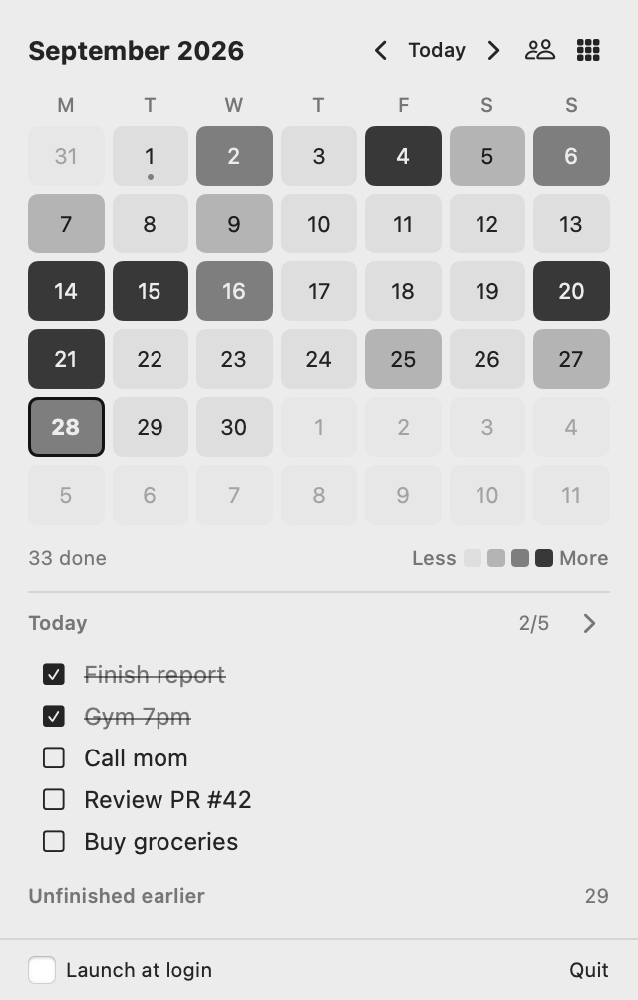
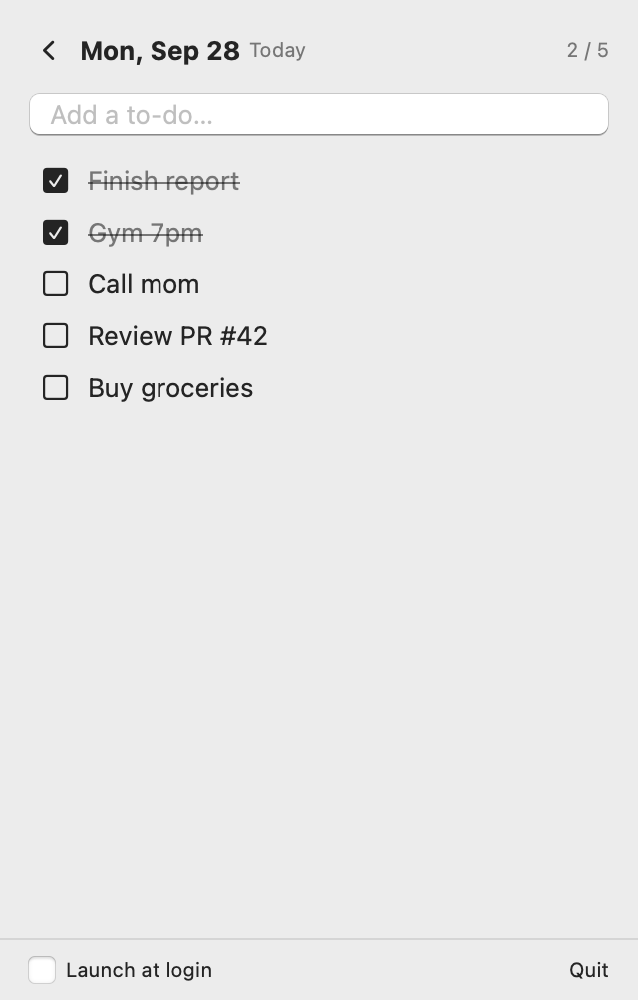

# DayStack

A tiny calendar + to-do list that lives in your Mac's menu bar, with a black-and-grey activity heatmap and to-do sharing with friends.

<p>
  
  
</p>

## ⬇️ Download

**[Download DayStack.dmg](https://github.com/Sskskxi/toy-calendar/releases/latest/download/DayStack.dmg)** (macOS 13 or later, Apple Silicon Mac)

1. Open `DayStack.dmg` and drag **DayStack** onto **Applications**.
2. Open **DayStack** from your Applications folder.
3. If macOS says it *can't verify* the app: open **System Settings → Privacy & Security**, scroll down, click **Open Anyway** next to DayStack, and confirm. You only need to do this once.
4. Look for the calendar icon in the menu bar at the top-right of your screen and click it.

> Don't see the icon? On MacBooks with a notch, extra menu bar icons can hide behind the camera. Quit an app or two, or check **System Settings → Menu Bar** and make sure DayStack is on.

## Features

- **Calendar:** each day is shaded grey → black by how many to-dos you finished that day.
- **Stacked heatmap:** the grid button shows the last 18 weeks, GitHub-style.
- **Quick to-dos:** click a day, type, press ⏎. Double-click a to-do to edit it; hover to delete.
- **Today at a glance:** today's to-dos and anything left unfinished from earlier days are shown under the calendar.
- **Friends:** share full to-do lists and heatmaps through a shared iCloud Drive folder.
- **Updates:** an **Update** button appears when a new version is published to your group.
- **Launch at login**, light and dark mode.

## Apple Reminders sync

Tick **Reminders** at the bottom of the panel and allow access when macOS asks. DayStack creates a **DayStack** list in Reminders and keeps it in two-way sync:

- To-dos you add in DayStack appear in Reminders, on your iPhone too via iCloud.
- Reminders you add, complete, rename, reschedule or delete in the DayStack list come back into DayStack.
- Your other Reminders lists are never touched.

## Ask Claude to plan for you (MCP)

DayStack ships with a small MCP server, so Claude can read and edit your to-dos. Just say things like *"add a plan: dentist tomorrow at 3pm"* or *"plan my study schedule for this week in DayStack"*.

**Claude Code:**
```bash
claude mcp add --scope user daystack -- /Applications/DayStack.app/Contents/MacOS/daystack-mcp
```

**Claude Desktop:** add this to `~/Library/Application Support/Claude/claude_desktop_config.json`, then restart Claude:
```json
{
  "mcpServers": {
    "daystack": { "command": "/Applications/DayStack.app/Contents/MacOS/daystack-mcp" }
  }
}
```

Tools: `list_todos`, `add_todo`, `add_todos`, `update_todo`, `delete_todo`. Changes show up in the menu bar instantly.

> ChatGPT's desktop app only supports MCP servers hosted on the internet, so it can't use this local server.

## Sharing with friends

Everyone needs DayStack and iCloud Drive turned on.

**To create a group:**
1. Click the menu bar icon → the people button → **Create a group**. You'll get a 6-character invite code.
2. Click **Share folder…**. In Finder, right-click the `DayStack-XXXXXX` folder → **Share** and invite your friend.
3. Send your friend the invite code.

**To join a group:**
1. Accept the iCloud folder invite from your friend.
2. Click the menu bar icon → the people button → enter the code → **Join**.

Friends' to-dos refresh every 20 seconds; iCloud may take up to a minute to sync changes.

## Your data

To-dos are stored locally in `~/Library/Application Support/DayStack/todos.json`. When you're in a group, a copy is written to the shared iCloud folder so friends can see it. Nothing is sent anywhere else.

## Building from source

Requires the Xcode Command Line Tools (`xcode-select --install`).

```bash
./build.sh            # builds build/DayStack.app and build/DayStack.dmg
./build.sh --publish  # also copies the update + installer into your iCloud group folder
```

To release a new version, bump the number in `VERSION`, run `./build.sh`, and attach `build/DayStack.dmg` to a new GitHub release.
